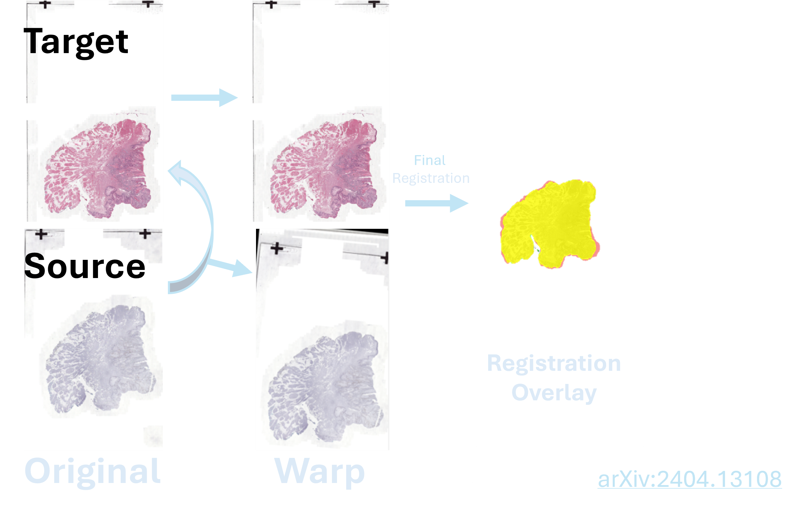
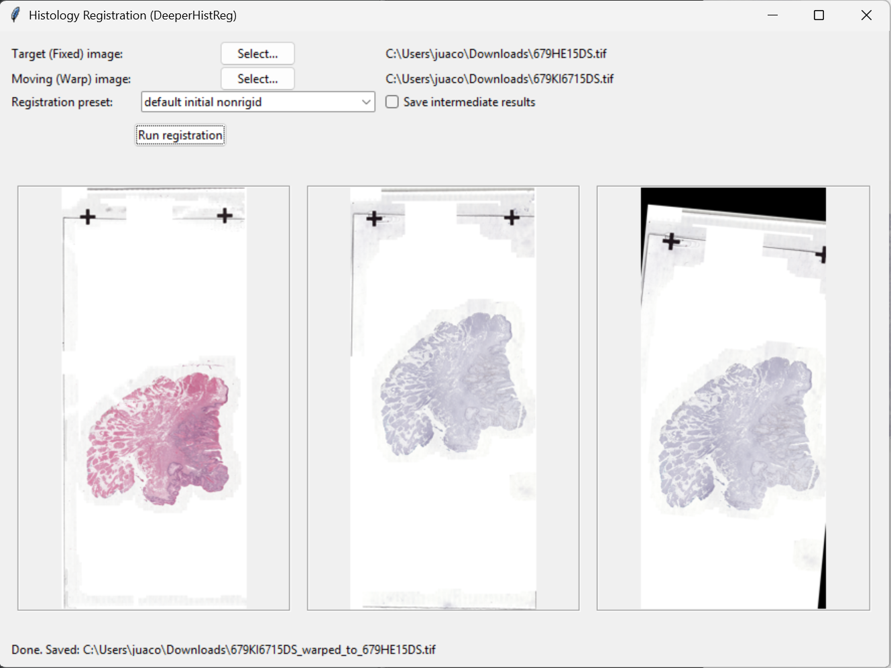

# HistRegGUI
### GUI for histological image registration using DeeperHistReg (CPU-only, Windows)

HistRegGUI is a standalone Windows application that runs **DeeperHistReg** to register a *moving* histology image onto a *fixed (target)* image and saves the warped output as a TIFF.

This distribution is configured to run **CPU-only** (CUDA disabled) for portability and to avoid GPU/CUDA runtime issues.



---

## 📥 Download (v1.0)

Go to the **Releases** page and download:

- `HistRegGUI.zip` (contains `HistRegGUI.exe` and required runtime folders)
- `HistRegGUI_Protocol_v1.0.pdf`

Extract the ZIP and run:

```
HistRegGUI.exe
```

No installation required.

---

## 🚀 Quick Start

1. Select **Target (Fixed)** image  
2. Select **Moving (Warp)** image  
3. Choose a **Registration preset**  
4. (Optional) enable **Save intermediate results**  
5. Click **Run registration**

Output file naming:

```
<moving>_warped_to_<fixed>.tif
```


---

## 🧠 What it does (high level)

1. Builds a preset list dynamically from `deeperhistreg.configs` (only no-argument config factories that return a dict).
2. Forces CPU execution (disables CUDA).
3. Runs full-resolution registration with DeeperHistReg.
4. Locates a displacement field (`*.mha`) in the run folder.
5. Applies deformation to warp the moving image to the fixed image.
6. Saves the warped output TIFF next to the fixed image.
7. Optionally deletes intermediate run outputs if not requested.

---

## 🖼 Supported Inputs

Accepted formats in the file picker:

- TIFF / TIF
- JPG / JPEG
- PNG
- BMP

---

## ⚙ Presets

Presets are auto-discovered from DeeperHistReg configuration factories. Common patterns include:

- **Initial + Nonrigid (default)**: initial alignment + non-rigid deformation
- **Nonrigid**: non-rigid deformation only
- **Rigid**: rotation + translation
- **Initial**: initial alignment only

Note: the exact preset names available depend on the DeeperHistReg version bundled with the release.

---

## 🧪 Troubleshooting

- If registration fails, an error popup is shown and a log file is written next to the fixed image:

```
HistRegGUI_error.log
```

- If you want to keep all intermediate outputs (including displacement fields), enable:
  **Save intermediate results**

---

## 🖥 System Requirements

- Windows 10 / 11 (64-bit recommended)
- RAM depends on image sizes and presets (16 GB recommended for large images)
- No internet connection required

---

## 📘 Documentation

- Protocol (Markdown): `protocol/HistRegGUI_Protocol.md`
- Protocol PDF: included in GitHub Releases

---

## ⚖ Licensing

- **HistRegGUI wrapper code** (this repository): MIT License (see `LICENSE`).
- **DeeperHistReg**: **Creative Commons Attribution–ShareAlike 4.0 International (CC BY-SA 4.0)**.

If your release package includes the DeeperHistReg source code (e.g., vendored in a `deeperhistreg/` folder), distribution must comply with CC BY-SA 4.0, including:
- providing attribution to DeeperHistReg authors, and
- sharing adaptations under the same (or a compatible) license when applicable.

Other bundled components (e.g., PyTorch, Pillow, libvips) remain under their respective licenses. See `THIRD_PARTY_NOTICES.md`.

---

## 🙏 Attribution

This project uses **DeeperHistReg** for registration. Please cite/acknowledge DeeperHistReg according to its upstream guidance and license terms (CC BY-SA 4.0).
